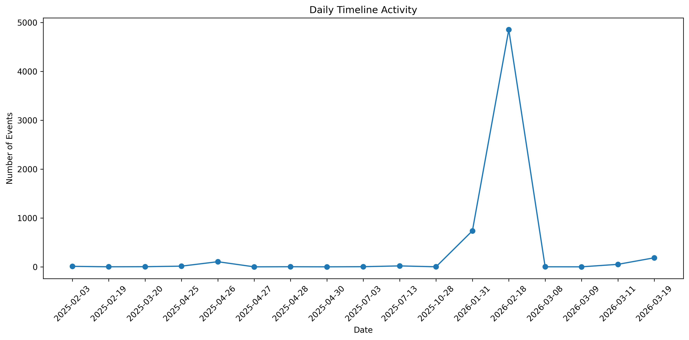
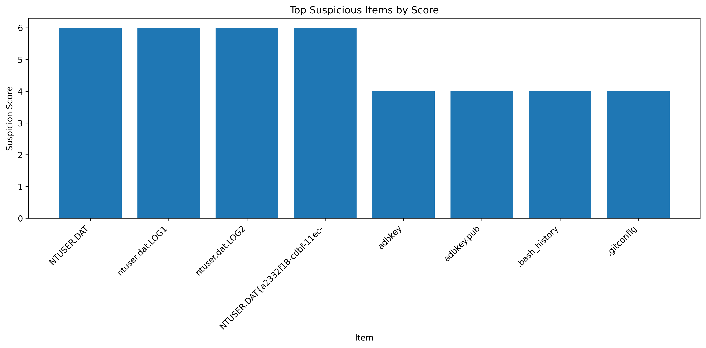
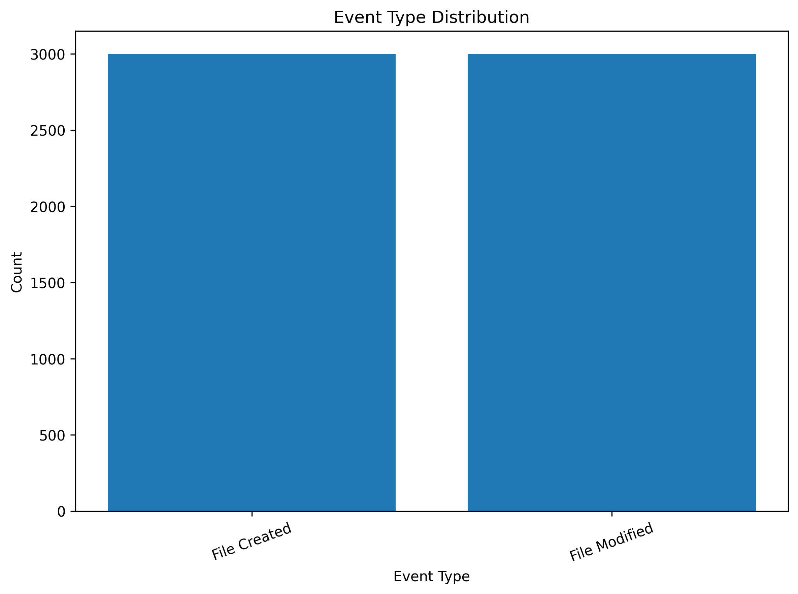

# Automated Digital Evidence Timeline Generator

A Python-based digital forensic tool designed to automatically generate chronological timelines from Windows-based systems. The tool assists investigators by collecting file metadata, identifying event types, filtering events, correlating activity, detecting suspicious behaviour, and generating structured reports and visualisations to support forensic investigations.

This tool was developed as part of an MSc dissertation project in **Digital Forensics and Cyber Investigation** at **Teesside University**.

---

## Key Features

* Live system analysis
* Mounted forensic evidence analysis
* Automated timeline generation
* Event-type identification (Created / Modified / Accessed)
* Event-type filtering
* Date and time range filtering
* Event correlation (grouping related file activity)
* Suspicious activity detection with score-based reasoning
* Reduced false positives using benign path filtering
* Confidence scoring for timeline events
* Visualisation of activity patterns
* Modern HTML forensic report generation
* Structured CSV and JSON outputs
* Case-based investigation folder structure
* Command-line forensic investigation interface

---

## System Workflow

1. The investigator launches the tool.
2. Investigator enters **Investigator Name** and **Case ID**.
3. Investigator selects analysis mode:

   * Live PC Analysis
   * Mounted Evidence Drive Analysis
4. (Mounted mode) Investigator provides mounted drive path.
5. Tool collects file metadata and extracts timestamp-based events.
6. Investigator selects event-type filtering options.
7. Investigator optionally applies **date/time filtering**.
8. Events are sorted into a chronological raw timeline.
9. Events are correlated into structured timeline artefacts.
10. Suspicious activity is detected using heuristic scoring.
11. Visualisations and reports are generated automatically.

---

## Requirements

* Python 3.9 or higher

Install required dependency:

```bash
pip install matplotlib
```

---

## Running the Tool

Run the program:

```bash
python main.py
```

### Example Interface

```text
======================================================================
        Automated Digital Evidence Timeline Generator
======================================================================

Investigator Name: Asad
Case ID: CASE001

Select Analysis Mode
1. Live PC Analysis
2. Mounted Evidence Drive Analysis
```

Mounted mode:

```text
Enter mounted drive path (example I:\)
```

Filtering options:

```text
Filter by event type before export?
1. All events
2. File Created only
3. File Modified only
4. File Accessed only
5. Created + Modified
6. Created + Modified + Accessed
```

Date/time filtering:

```text
Start date/time: 2026-01-01
End date/time: 2026-01-05
```

---

## Output Files

Results are stored in a case folder:

```text
cases/
└── CASE001/
```

### Generated Outputs

```text
timeline_raw.csv
timeline_raw.json
timeline_correlated.csv
timeline_correlated.json
suspicious_activity.csv
suspicious_activity.json
investigation_summary.json
investigation_report.html
daily_activity_timeline.png
suspicious_score_chart.png
event_type_distribution.png
```

---

## Output Description

| File                        | Description                                         |
| --------------------------- | --------------------------------------------------- |
| timeline_raw.csv            | Raw chronological event list                        |
| timeline_raw.json           | Structured raw timeline                             |
| timeline_correlated.csv     | Grouped file activity with event types and counts   |
| timeline_correlated.json    | Structured correlated data                          |
| suspicious_activity.csv     | Suspicious items with scores and reasons            |
| suspicious_activity.json    | Structured suspicious data                          |
| investigation_summary.json  | Summary of findings and statistics                  |
| investigation_report.html   | **Modern forensic report with charts and analysis** |
| daily_activity_timeline.png | Timeline activity over time                         |
| suspicious_score_chart.png  | Top suspicious items by score                       |
| event_type_distribution.png | Distribution of event types                         |

---

## Visualisation Features

The tool generates visual insights to assist investigation:

* Timeline activity trends (daily activity)
* Suspicious artefact prioritisation
* Event-type distribution analysis

> Source-based charts are dynamically excluded when only one evidence source is present, ensuring only meaningful visualisations are produced.

---

## Suspicious Activity Detection

Suspicious activity is identified using:

* Event frequency analysis
* Multiple timestamp correlations
* File type indicators (e.g., executables, scripts, archives)
* Path-based relevance (Downloads, Desktop, User folders)
* Confidence scoring
* Heuristic scoring system

False positives are reduced by excluding:

* Development environments (e.g., VS Code)
* Cache and temporary files
* System-generated logs

---

## HTML Report

A modern forensic HTML report is generated containing:

* Case details
* Source metadata (including storage size in readable format)
* Timeline summary statistics
* Visual charts
* Top suspicious artefacts with explanations

This report provides a **single consolidated view** of the investigation and is suitable for:

* Investigator review
* Demonstration (viva)
* Evidence reporting

---

## Forensic Workflow Example

1. Acquire forensic image
2. Mount image using **FTK Image Mounter**
3. Run the tool
4. Enter case details
5. Select mounted mode
6. Provide drive path
7. Apply filters if required
8. Review generated outputs and HTML report

---

## Repository Structure

```text
project/
│
├── main.py
│
├── modes/
│   ├── live_mode.py
│   └── mounted_mode.py
│
├── core/
│   ├── timeline.py
│   ├── correlator.py
│   ├── suspicious_detector.py
│   ├── investigation_summary.py
│   ├── event_filter.py
│   ├── time_filter.py
│   └── source_metadata.py
│
├── visualization/
│   └── timeline_visualizer.py
│
├── reporting/
│   └── html_report.py
│
└── cases/
```

---

## Academic Context

This tool was developed as part of a postgraduate research project titled:

**"An Automated Digital Evidence Timeline Generation System for Windows-Based Forensic Investigations"**

**Author:** Muhammad Asad
**Supervisor:** Harry Stewart
**Programme:** MSc Digital Forensics and Cyber Investigation
**Institution:** Teesside University

---

## Disclaimer

This tool is intended for **educational and research purposes only**.
All forensic investigations must comply with legal, ethical, and organisational standards.

---

## Author

**Muhammad Asad**

MSc Digital Forensics and Cyber Investigation
Teesside University


## Screenshots

The following screenshots demonstrate the output and functionality of the Automated Digital Evidence Timeline Generator.

### HTML Investigation Report

A consolidated forensic report containing case details, source metadata, timeline summary, visualisations, and suspicious artefacts.


---

### Daily Activity Timeline

Visual representation of timeline events over time, highlighting periods of high activity and potential incident spikes.



---

### Suspicious Items by Score

Displays the highest-ranked suspicious artefacts based on heuristic scoring and investigation relevance.



---

### Event Type Distribution

Shows the distribution of file system events (Created, Modified, Accessed) within the generated timeline.



---
